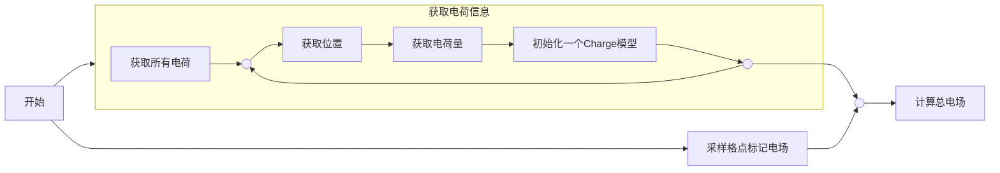

<link rel="stylesheet" href="https://cdnjs.cloudflare.com/ajax/libs/font-awesome/4.7.0/css/font-awesome.min.css"/>
<link rel="stylesheet" href="/styles/style.css"/>

# 库仑定律与静电场
Coulumb's Law and SEFs


<button @click=$nav.next>
<div class="pt-24">
    <i>Press <kbd>space</kbd> or click to page <i class="fa fa-chevron-right fa-fade" style="font-size:13px;"></i></i>
</div>
</button>

<!--
大家好 我们做的是库仑定律与静电场
- 介绍
- 推导
-->

---
transition: slide-left
---

# 静电是什么?

和电流相对的就是静电，单独的电荷。我们一般在冬天被电到也是因为静电电荷形成的电势差导致的。
在自然界中，一个静电荷可以是一个电子或者一个质子。

<v-click>
  <div class="h-container">

  <div>

  ## 质子
  **质子 (Proton)** 是一种自然界中的电荷，携带正电荷。它的电荷量为 $+1.602 \times 10^{-19}$ 库伦。质子存在于原子核中，能够形成静电荷。当质子失去电子时，它形成一个正的静电荷。

  </div>

  
  </div>
</v-click>

<v-click>
  <div class="h-container">

  <div>

  ## 电子
  **电子 (Electron)** 是一种自然界中的电荷，携带负电荷。它的电荷量为 $-1.602 \times 10^{-19}$ 库伦。电子围绕原子核运动，能够形成静电荷。当电子被孤立时，它会产生负的静电荷。

  </div>

  
  </div>
</v-click>

<!--
- 静电就是不在动的电荷
- 自然界中有质子和电子
  - 质子正电
  - 电子负电
  - 两者电荷正好相反
-->

---
layout: image
image: /assets/CoulumbPortrait.png
transition: slide-up
---

<style>
  .content {
    padding: 100px
  }
</style>

<div class="content">

# 静电场是什么？
就像在物理课中说过的一样，同种电荷相互排斥，但为什么呢？要想解释这一点，我们就需要了解一个定律：**库仑定律**

## 库仑定律
库仑定律是由法国物理学家查尔斯·奥古斯丁·库仑在1785年通过一系列实验发现的。他利用自己发明的扭秤，精确测量了电荷之间的作用力，发现这种力与电荷量的乘积成正比，与它们之间距离的平方成反比。这一定律是电学史上的重要里程碑，为静电学奠定了基础。库仑的研究不仅验证了电荷间的基本相互作用，还揭示了自然界中普遍存在的平方反比规律，为后来的电磁理论和物理学发展开辟了新道路。
</div>

<!--
静电场是静电荷产生的电场
-->

---
transition: fade
---

# 库仑定律推导

那库仑定律是怎么推导出来的呢？

## 0x00 定性分析

- 由于库仑定律适用于三维空间，所以电场符合**平方反比律**，即 **$\mathbf{E} \varpropto \frac{1}{l^2}$**, 其中 **$l$** 为到场源（电荷）的距离.
- 根据定义，电场与电荷呈正比，即 **$\mathbf{E} \varpropto q$**, 其中 **$q$** 是电荷量

综上，**$\mathbf{E}$** 可以表示为这样的形式：

<h3> 
 
  $$\mathbf{E} = \frac{kq}{l^2}$$

</h3>

其中 **$k$** 为某个常数, **$l$** 为到场源（电荷）的距离, **$q$** 为电荷量。

<!--
首先，我们进行定性分析
- **我们分析的**(这一点很重要)电场是在三维空间中的，所以电场符合平方反比律
- 也就是说 电场E正比于一分之l方
- 根据定义，电场与电荷成正比。
所以E=某个常数k乘以q除以l方，其中l为到电荷的距离，q为电荷的电荷量
-->

---

# 库仑定律推导

那库仑定律是怎么推导出来的呢？

## **定义** *平方反比律*
<div class="h-container">

是一种物理定律，表明某些物理量（如光强、引力、静电力等）与**距离的平方成反比**。这意味着随着距离的增大，这些物理量的强度会迅速减弱。平方反比律的来源可以追溯到点源的辐射或力的分布。在三维空间中，随着距离的增加，能量或力的“分布面积”以**平方比例**增加，因此强度会**减弱**为距离的平方反比。如右图中，场的强被均匀的散在了$a^2$与$b^2$的球面上，因此场强之比为 **$a^{-2} : b^{-2}$**, 顾 **$\mathbf{F}(l) \varpropto \frac{1}{l^2}$**


</div>

<!--
平方反比律
- 与距离成平方反比
- 想象一个球面，在膨胀
- 那么它的球面面积与距离的平方呈正比，因为它等于4pi乘以r的平方
- 而且当场的强度被均摊在这面积上了，所以场强与面积呈反比，与距离呈平方反比。
-->

---

# 库仑定律推导

那库仑定律是怎么推导出来的呢？

## 0x01 量纲分析

- 我们分析 **$\mathbf{E}$** 的量纲可以发现，这个场的单位为 **$\mathrm{N/C}$**. 
- 鉴于 **$\mathbf{F}_{q_1, q_2}$** 一定与 **$q_2$** 正相关，最简单的且合理假设就是 **$\mathbf{F}_{q_1, q_2} = q_2\mathbf{E_1}$**.

综上，**$\mathbf{E}$** 可以表示为这样的形式：

<h3> 
 
  $$\mathbf{E} = \frac{kq_1q_2}{r^2}$$

</h3>

事实上，这里的 **$k_e$** 有个名字叫 **库仑常数**，大小约为 **$k_e = 8.9875 \times 10^9 \mathrm{N \cdot m^2 / C^2}$**.

<!--
接下来进行量纲分析
易得E的量纲为力除以电荷，而且q的是电荷，也就是说电场力可以通过电场乘以另一个电荷的电荷量q乘以某个常数得到

也就是说两个电荷之间的力可以通过 F=k q1 q2 除以 r方 得到

这里的ke叫库仑常数，大小为8.9875乘以10的九次方 牛乘以平方米每平方库仑
-->

---

# 库仑定律推导

那库仑定律是怎么推导出来的呢？

## 0x02 拓展至场表达式

让我们回到一开始的那个电场表达式

我们知道，位于$Q$的电荷发出的电场在$P$一定在直线$QP$上。同时，一个一个正电荷的电场方向一定与$\overrightarrow{QP}$相同。由此可得:

<h3>  

$$
\vec{\mathbf E}(\vec P) = \mathbf{E}\times\mathrm{normalize}(\overrightarrow{QP}) \\
= \frac{k_eq_1q_2}{r^3}\overrightarrow {AP} \\ 
= \frac{k_eq_1q_2}{r^3}(\vec P - \vec Q)
$$

</h3>

<!--
继续拓展
这里就看ppt吧 公式是这样读的：
电场E在P电的强度 等于E乘以平行于AP的单位向量 
也就是ke q1 q2除以r立方 乘以向量P与向量Q的差
-->

---

# 库仑定律推导

那库仑定律是怎么推导出来的呢？

## 0x03

由于力场是可以通过线性叠加的，我们可以得到

<h3>

$$\mathbf F_E = \sum \vec F_q$$

</h3>

且每个电荷的电力场与电场线性相关，我们就可以得到 $\mathbf E = \sum \mathbf E_q$

自此，库仑定律的完成体出现了：

<h3>

$$\mathbf F_e(\vec P) = q_0\sum_i{\frac{k_eq_i}{r^3}(\vec P - \vec Q_i)}$$

</h3>

<!--
我们知道，合力是可以通过线性叠加各个力来得到的。电场里也是一样的，也就是是说
电场力等于q0 乘以 对于所有电荷Qi来说的ke qi 除以 r立方 乘以 向量P与向量Qi的差
-->

---

# 可视化

我们通过以下算法可以实现对于一个静电场的可视化


<div class="h-container">

1. 找到所有电荷
2. 记录其电荷量与位置
3. 记录下来
4. 计算总电场
5. 采样格点并标记（这里用箭头）

```python
class Charge:
    def __init__(self, k: float, pos):
      ...
    def __call__(self, pos):
      ...
      fieldx = -(self.k * (posx - self.x)) / (r**3)
      fieldy = -(self.k * (posy - self.y)) / (r**3)
      fieldz = -(self.k * (posz - self.z)) / (r**3)


```

</div>
<!--
算法大概这牙膏
1. 找到所有电荷
2. 记录其电荷量与位置
3. 记录下来
4. 计算总电场
5. 采样格点并标记（这里用箭头）
-->

---
layout: center
---

# 就直接下一页，后面我会贴一些东西

<!--
然后，这就是结果：（一字不差说这句话）
-->

---
layout: center
---

# 谢谢观看

<!--
然后感谢啊，啥的看你发挥哈

加油
-->
